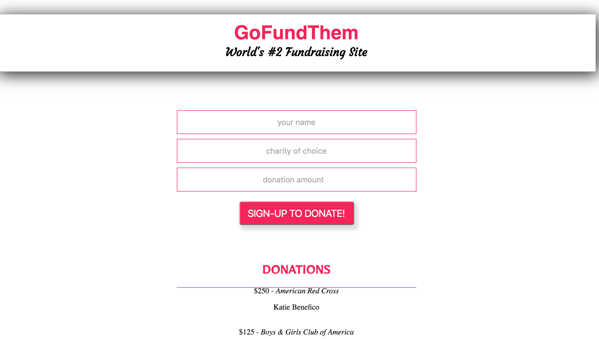

# GoFundThem

### A simple ReactJS + Express/node.js app that ties a user form on the front-end to a PostgreSQL database on the back-end.

User has the ability to sign-up to donate to a charity of their choice. (*Please note this application does not actually link to any charities or payment methods, it is just a sign-up form).  When a user clicks submit, their submission (name, charity, amount) are added to the continous vertical scrolling 'Donations' list below. 

Tech used:
* HTML5
* CSS
* ES6 
* ReactJS
* node.js
* Express
* PostgreSQL
* Webpack
* Babel
